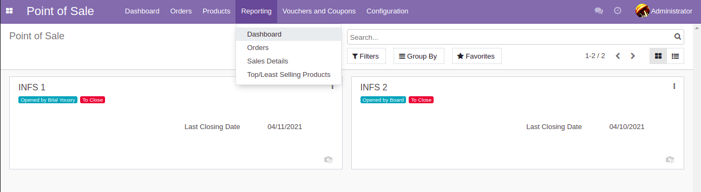
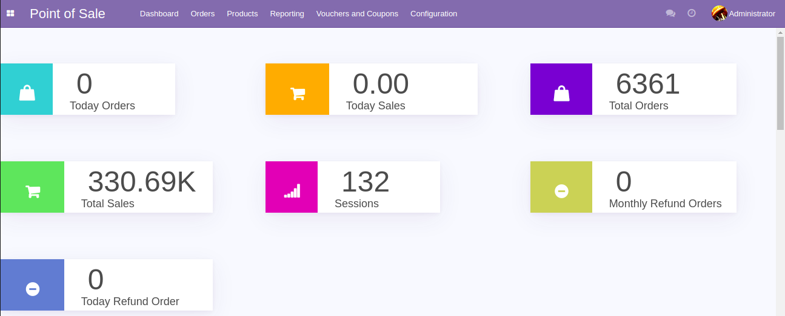
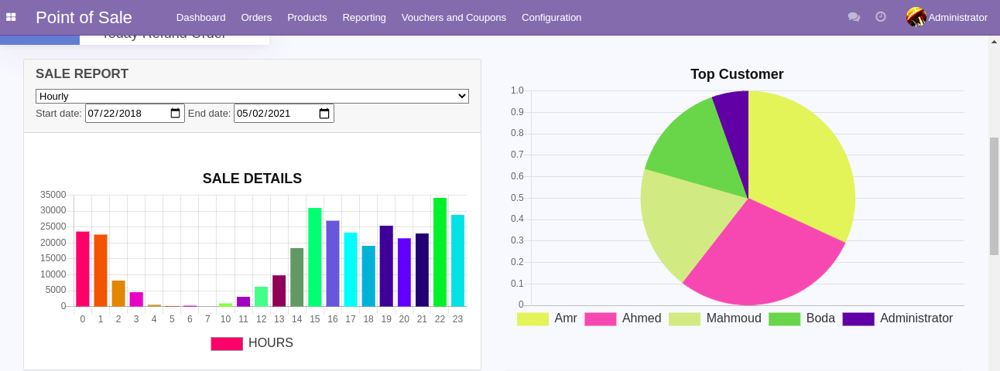
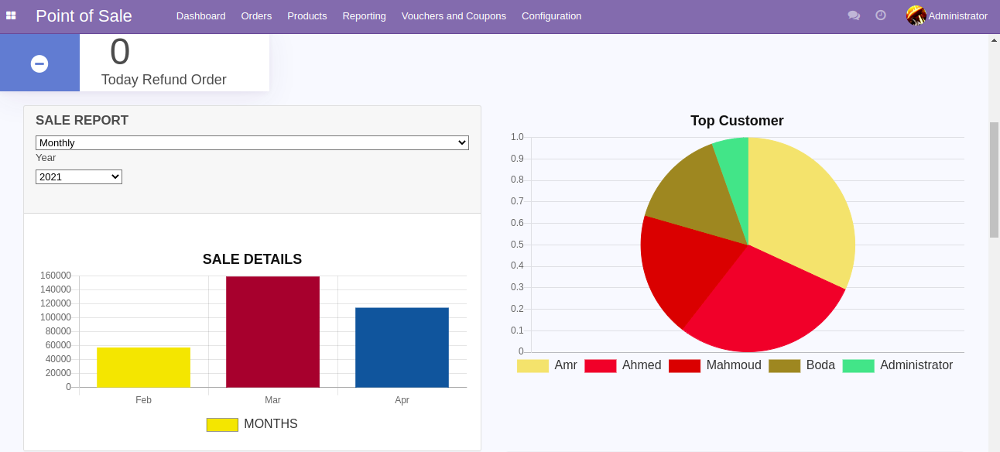
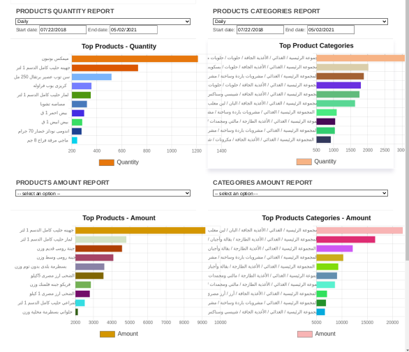
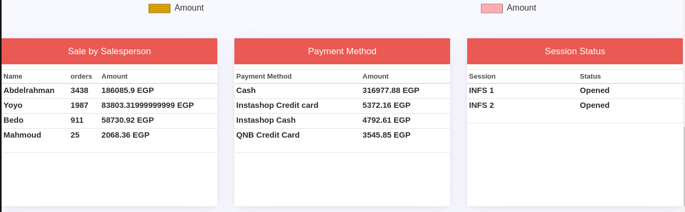

# dashboard
Detailed Dashboard View for Odoo 14.0 Point Of Sale | Code is gonna be open sourced soon

### Key Highlights
-  Total Pos Orders
- Session Details
- Customer List
- Sale Report

> This module helps you to see the Overview of POS, here You can see the total orders, sessions, top customers, top products etc
> Less featured open source module for Odoo 13 has +951 downloads in Odoo Apps Store

### Features
- Total Pos Orders
- Session Details
- Refund Details
- Sale Details
- Sale Report Charts
- Top Products

### TODO
Time series analysis for analyzing time series data in order to extract meaningful statistics and other characteristics of the data and detection of trends, seasonality and cycles.
