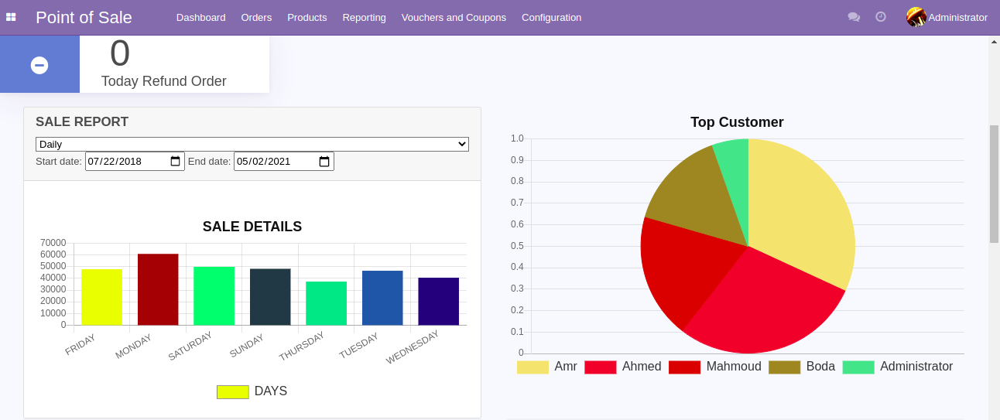

# dashboard
Detailed Dashboard View for Odoo 14.0 Point Of Sale | Code is private untill revamping 

### Key Highlights
-  Total Pos Orders
- Session Details
- Customer List
- Sale Report

> This module helps you to see the Overview of POS, here You can see the total orders, sessions, top customers, top products etc

> Less featured open source module for Odoo 13 has +951 downloads in Odoo Apps Store

### Features
- Total Pos Orders
- Session Details
- Refund Details
- Sale Details
- Sale Report Charts
- Top Products

 

    
<strong>Tools and Technologies:</strong>

     <table align="center">
         <tr align="center">
             <td  align = "center"> Python</td>
             <td  align = "center"> Postgresql</td>
             <td  align = "center"> XML-RPC</td>
             <td  align = "center"> HTML</td>
             <td  align = "center"> CSS</td>
             <td  align = "center"> JavaScript</td>
             <td  align = "center"> Chart.js</td>
         </tr>    
    </table>

### TODO
Time series analysis for analyzing time series data in order to extract meaningful statistics and other characteristics of the data and detection of trends, seasonality and cycles.
